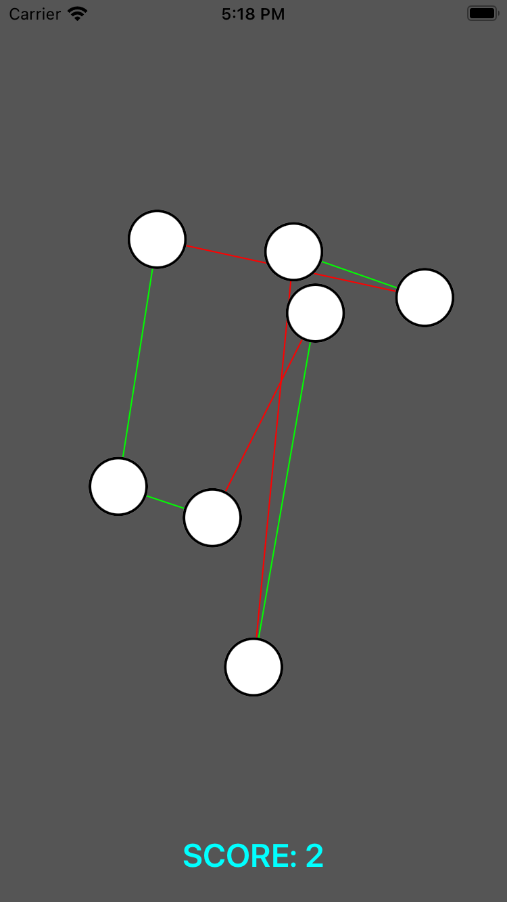
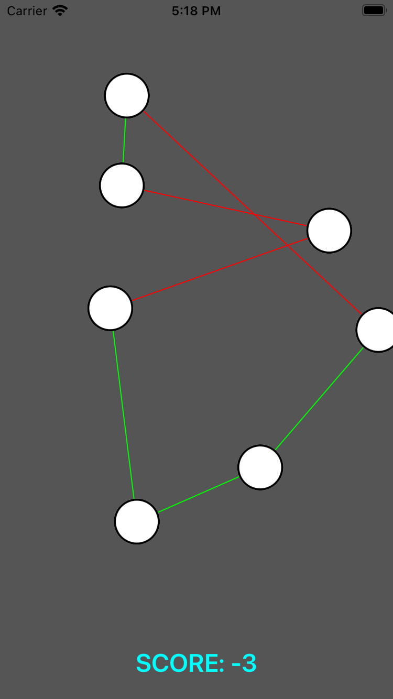
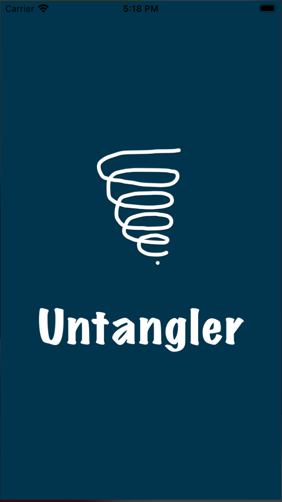
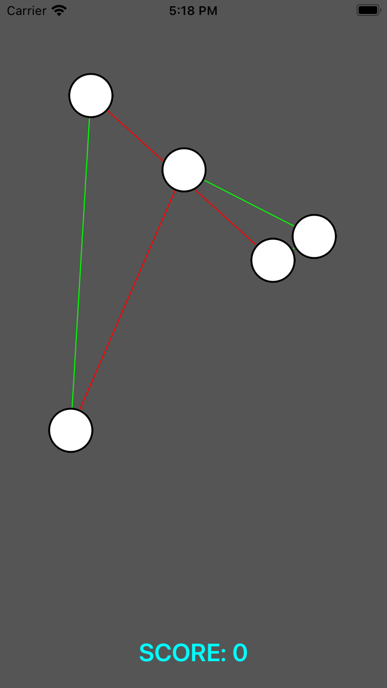

  

  

  

 

---

  
Quick Links
   

  

  
 
  
 
  

---

### The Untangler app is available for beta test in testflight 🥳 🚀

- install the testflight and redeem the app from following link [Testflight](https://testflight.apple.com/join/wmZyBeT3).

---

 

**[PROJECT PHILOSOPHY](https://github.com/chroline/well_app#-project-philosophy) • 
[WIKI](https://github.com/chroline/well_app#-wiki) • 
[TECH STACK](https://github.com/chroline/well_app#-tech-stack) • 
[SPREAD THE WORD](https://github.com/chroline/well_app#-spread-the-word) • 
[LICENSE](https://github.com/chroline/well_app#%EF%B8%8F-license)**

 

# 🧐 About project

> 
Untangled is game its based on clear the mess of lines with the minimum amount of movements. By correcting the nodes that attached the lines. Score is given according to the movements you are using for correction of the nodes. Each level is getting harder when you advance through the levels. This is a Personal project done by using UIKit. layout is created by using programmatic way.

# 🌟 Screenshots 
|     |   	|   	|   	|   	|
|---	|---	|---	|---	|---	|
|   	|   	|   	|   	|   	|
 	

# 👨‍💻 Tech stack

Here's a brief overview of the tech stack the Tangler uses:

- UIKit
-  Core graphics
- Functional programming
- Layout building - programmatic way

 

 

